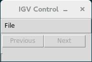

# igvcontrol

Control your IGV.

## Install

### Installing the last version

Clone the repo to your local system with:

    git clone git@github.com:xbello/igvcontrol.git

### Installing a released version

Download the .zip/.tar.gz from https://github.com/xbello/igvcontrol/releases and uncompress it.

`igvcontrol` is only tested with `python 3.4.3`. All third party libraries are listed in the text files under `requirements` dir. Enter the directory created with the `git` command above and type:

    pip install -r requirements/base.txt

Now you should be able to run, and check everything is OK:

    $ python cmdline.py -h
    
    usage: cmdline.py [-h] [--variants VARIANTS] [--gui]
    
    Manage IGV through sockets.
    
     optional arguments:
     -h, --help           show this help message and exit
     --variants VARIANTS  Path to file with variants. It works with VCF or TAB
                          files.
     --gui                Launch a Tkinter Gui to control IGV

## Running

### GUI

To control your IGV from a GUI interface, launch your IGV program. Then launch the `igvcontrol` with the command:

    $ python cmdline.py --gui

Or

    $ python guimode.py

Dismiss any message saying that IGV was not detected. Something like the following window should appear:

Open a file with variants in the menu, in tab or VCF format. The "Next" button should be available to start navigating the IGV.

### CLI

If you don't like all the clicky-clicky, you can launch the CLI with:

    $ python cmdline.py --variants path/to/variants/file.tab  # (or .vcf)

If the variant file is loaded, something like this should happen:

    Press <- or ->, [q] to quit

Browse the variants with your left and right arrows.

Enjoy!
